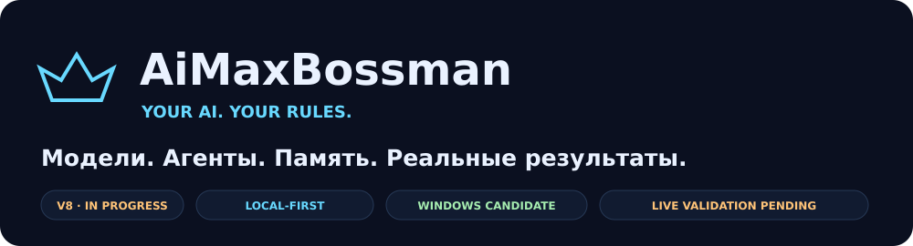
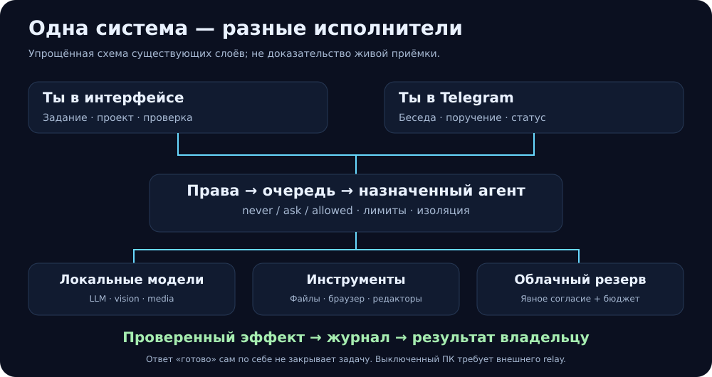
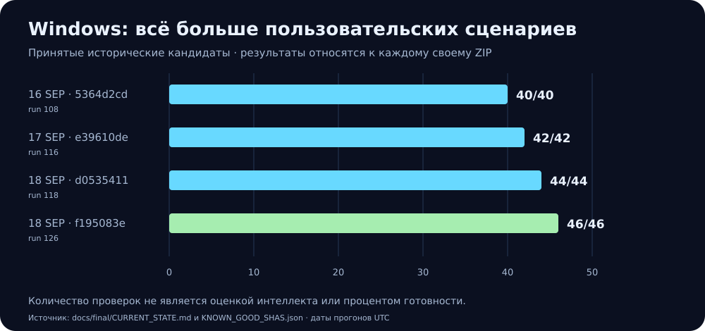
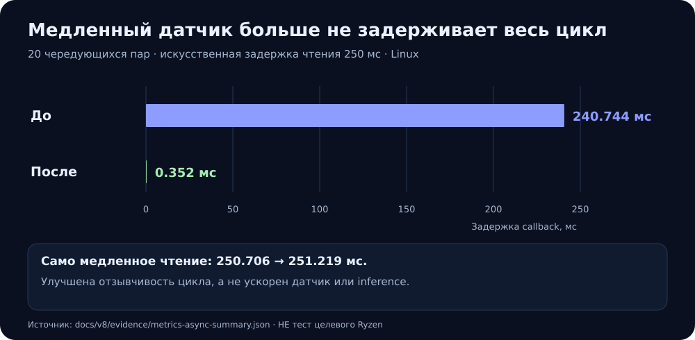
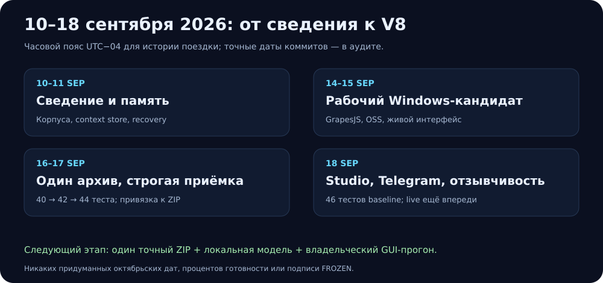
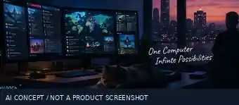
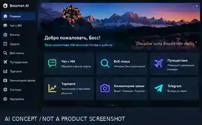
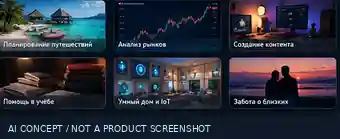

<p align="center"></p>

# AiMaxBossman — V8, единая финальная ветка

**Обновлено 20 сентября 2026 по локальной дате владельца; контрольная сессия UTC — 21 сентября.** Единственная ветка дальнейшей интеграции: `claude/bossman-final-convergence-hu2702`.

**Полный V8 Total ещё не принят.** Объединение истории, успешные unit tests и зелёный Windows RC не заменяют новую приёмку объединённого приложения. Не меняйте SHA старого архива и не называйте его новой сборкой.

[Начать GUI-прогон](docs/v8/OWNER_GUI_START_HERE_RU.md) · [Установка](INSTALL.md) · [Отчёт текущей конвергенции](docs/final/convergence-20260920/SESSION_RU.md) · [Решения слияния](docs/final/convergence-20260920/MERGE_DECISIONS_RU.md) · [Полное предыдущее руководство и визуализация](README_GUIDE_20260918.md)

## Что объединено

Основная линия `6cb62d92978baaf16207199d973821cdf09e0ae1` сохранена вместе с `release/bossman-owner` на `ce095d556fd9e65d7b7c84a35fb14dd3d0a240f6`. Документ Dashboard Next на `7db0db970f92a2fac185acfc7b4492be5b96a823` также включён: это **FUTURE-контракт**, не уже написанный новый интерфейс. Предыдущие ветки и коммиты не удаляются.

Шесть коммитов image-кандидата на `43bc5e4bd2f291ea576f52eff301215567d428b8` сохранены в истории и побайтно в [отдельном каталоге](integrations/openai-image-candidate/REVIEW_RU.md), но **не активированы в runtime**: прямой платный POST без канонического разрешения/тарифа нельзя включать ради зелёного отчёта. Не смешивайте сохранение кода с его приёмкой.

Сохранены authoritative tariff PREP-03, отмена shared telemetry, истинность измерений, owner fixtures и проверки отката. Спорные пересечения разобраны в журнале слияния; общий CI обязан проверить именно новый совмещённый SHA.

## Рабочие области

Command Center объединяет модели, агентов, задачи, approvals, бюджеты, память, браузер, файлы и приложения. Web Designer использует GrapesJS; Video Studio — FFmpeg и проверку выходных байтов. Studio, Telegram Companion, Trading Lab и инструменты компьютера остаются в общей системе прав. Offline/local-first не означает, что все внешние сервисы доступны без сети.



## Два отдельных скилла

| Скилл | Реально добавленный путь | Граница |
|---|---|---|
| [open-news](.agents/skills/open-news/SKILL.md) | `open_news.search`: один подтверждаемый RSS-запрос; `open_news.process`: локальная фильтрация и сокращение текста | Reviewed subset open-news, не полный crawler. Сниппеты не являются полными статьями или факт-проверкой. |
| [mimik](.agents/skills/mimik/SKILL.md) | `mimik.guide`: переданный Markdown-экспорт или Snapshot → текстовый чек-лист | Text export adapter, не установленное расширение, не запись экрана и не автоматический replay. Все действия остаются NOT_RUN. |

Оба скилла используют обычный model/tool-loop Bossman; дополнительные исполнители и фоновые мониторы не добавлены. MIT-лицензии, точные upstream pins и проверки упаковки сохранены в `integrations/`. Скиллы копируются в `bcc/_skills/` при сборке, без необходимости держать clone рядом с установленным приложением.

**Исправлен реальный барьер GUI:** форма Skills теперь отправляет числа, массивы и объекты правильными типами, предоставляет выбор enum и многострочное поле Mimik. Пустые необязательные поля не отправляются. Неправильный JSON останавливается до POST, а форма остаётся открытой с ошибкой.

**Исправлена релевантность open-news:** полученная RSS-выдача фильтруется локально по запрошенному `any/all/exact_phrase`. Отсутствие совпадений имеет отдельный статус `NO_MATCHING_RESULTS`, а не успешную подборку посторонних новостей.

Для первого теста используйте локального агента и маленький искусственный пример. До передачи Mimik-экспорта агенту удалите приватные данные и встроенные изображения: парсер не может отменить передачу, уже совершённую на этапе prompt облачной модели. Минимизация вывода не является гарантией полной анонимизации.

## Последний проверенный Windows RC, не новый объединённый релиз

[Actions-контейнер с application ZIP](https://github.com/molotroka123-cell/AiMaxBossman/actions/runs/35548359170/artifacts/10617033841) содержит приложение и отчёты. **Сам контейнер не является application ZIP.**

```text
Application: BOSSMAN-Windows-x64-ebdf227d1f5c.zip
Bytes: 783183197
SHA-256: e66b9ca284f0f248039a838c91510d8d6274f17d792a1914a29c2cda38417e9c
Source SHA = harness SHA: ebdf227d1f5c6348369372d94c07e204eb6f9954
Windows run: 35548359170
Release state: WINDOWS_RC_READY_OWNER_REQUIRED
```

На этих байтах hosted Windows выполнил installed-профиль **46/46, без ошибок и пропусков**, обход **31 страницы**, восстановление и проверку реальных файлов/медиа. Freeze manifest имеет `status=OWNER_REQUIRED` и `publish_gate.release_ready=false`: успешный job freeze не означает FROZEN. Живая модель и Studio не выполнены, а CIM определил Intel Xeon / Hyper-V / 16 GiB как `different`, не Ryzen владельца.

Этот RC содержит PREP-03 и open-news 1.0, но **не содержит Mimik, нового typed GUI, исправления RSS-фильтра и объединённой release-линии**. Нужен новый exact application ZIP и новая приёмка. Байты приложения в этой контрольной среде повторно не скачивались и не хешировались: данные взяты из связанного Windows acceptance. Маленький proof-архив скачан и его хэши сверены с манифестом.



## Проверки этой сессии

До push выполнены **131 Python-тест обоих скиллов**, **20 JavaScript-проверок формы**, тест совместимости с настоящей закреплённой функцией Markdown-экспорта Mimik и проверка синтаксиса. До исправления RSS-релевантности четыре новых теста падали; до исправления настоящего обработчика формы падали четыре wiring-теста.

Это Linux/Python 3.13.5/Node 22, частичная рабочая копия. HTTP — MockTransport, DOM/API в wiring-тестах — явные тестовые двойники. Копирование package assets не является сборкой полного wheel или Windows ZIP. Новый общий CI, браузерный owner-run и живые модели этим не подменяются.

```bash
PYTHONPATH=command-center python -m pytest -q command-center/tests/test_open_news_skill.py command-center/tests/test_open_news_query_regression.py command-center/tests/test_mimik_skill.py
node --test command-center/ui/tests/skill_inputs.test.mjs command-center/ui/tests/skills_run_wiring.test.mjs
node tools/test_mimik_export_contract.mjs
```

Проверки для интегратора из **полной рабочей копии**, не обязательные действия обычного владельца:

```bash
python tools/ci_secret_scan.py
python tools/skips_registry.py --check
python scripts/update_readme_scorecard.py --check
python tools/require_acceptance_results.py --help
python tools/installed_responsiveness_probe.py --help
python tools/exact_sha_certify.py --help
python docs/v8/readme-visuals/validate_readme.py --full-repo
```

Наличие команды в README не означает её выполнение. Пороги, скрытые skips и платные разрешения ради зелёного CI не ослабляются.

## Производительность и визуальное направление




Следующие три изображения — **AI_CONCEPT_NOT_SCREENSHOT**, дизайн-направление. Это **THEORETICAL/FUTURE**, не реальные скриншоты и не подтверждение реализованных контролов. Исходная атрибуция и проверки файлов сохранены в [описании визуалов](docs/v8/readme-visuals/README.md).





## Что действительно осталось для V8 Total

Требуются общий exact-SHA CI и новый ZIP, физический OpenCode+GUI-driver с калибровкой, локальная модель → инструмент → результат → рестарт, живая Studio → редакторы, native cold/warm и длительный full-process/model soak, смена двух ZIP с backup/rollback, Ryzen/shared-memory pressure/reclaim и paired Intelligence Preservation. Image-кандидат требует безопасного включения через существующую Studio governance, а не обхода.

Владелец начинает с [OpenCode setup](docs/v8/owner-final-run/OPENCODE_LOCAL_SETUP_RU.md), затем [GUI-протокола G00–G19](docs/v8/owner-final-run/OPENCODE_OWNER_RUN_RU.md). Историческая [память подготовки](docs/v8/owner-final-run/PREPARATION_MEMORY_RU.md) сохранена; новейший checkpoint находится в [отчёте конвергенции](docs/final/convergence-20260920/SESSION_RU.md). До полного принятия использовать тестовые проекты без ключей и личных данных; облако выключено.

## Исторический Live OS Scorecard

Ниже **не новая оценка V8**. Это неизменённая проекция `docs/benchmark/current-scorecard.json` с устаревшими evidence SHA и датой 7 сентября. Числа не повышались без измерений; текущий источник состояния — отчёт конвергенции и CI конкретного SHA.

<!-- BOSSMAN_LIVE_SCORECARD_START -->
| # | Ось системы | Оценка | Статус | Уверенность | Улики |
|---|---|---:|---|---|---|
| 1 | Execution Truth | 8.8/10 | VERIFIED | HIGH | AT-01 effect obligations and fresh post-state verification are closed with regression coverage; Fencing, anti-replay and recovery invariants remain in force; V6 performance work did not weaken effect-boundary semantics |
| 2 | Security | 8.5/10 | VERIFIED | HIGH | Secret scan and blocking SAST/SCA completed successfully on the V6 code candidate; Approvals, authorization, privacy routing, freshness and fail-closed behavior were explicitly preserved through V6 |
| 3 | Tooling / OS Integration | 7.5/10 | INTEGRATED | MEDIUM | Windows-path CI is green on the current V6 code candidate; Owner-session reconnect, app restart recovery, provider UX and Trading Lab crash paths have repository fixes |
| 4 | Organization Layer | 7.3/10 | INTEGRATED | MEDIUM | Mission/task orchestration remains durable and blocked-only missions now terminate honestly instead of appearing to run forever; Organization/Fleet execution contracts and verified-child completion rules remain covered |
| 5 | Fleet & Resources | 7.0/10 | INTEGRATED | MEDIUM | Lease/fence/queue safety contracts remain covered and V6 does not bypass the canonical execution path; Interactive work is protected from background FFmpeg contention by lowered child-process priority |
| 6 | Memory / Context | 6.5/10 | IMPLEMENTED | MEDIUM | Durable task/recovery memory and scoped context contracts remain intact; Long-session testing now explicitly watches stale context, zombie runs, duplicate subscribers and memory growth |
| 7 | Testing / CI | 8.0/10 | VERIFIED | MEDIUM | Bossman Core full coverage/rest/security/gateway/stage8-14 jobs are green on 413a97a1; ASTRA acceptance, Solana safety, Windows paths and secret/SAST gates are green; Python 3.14 is a hard Command Center lane |
| 8 | Observability / CEO Control | 7.0/10 | PARTIAL | MEDIUM | V6 adds Services.start phase tracing, UI_READY/first-page timing and Computer Use phase_timing; Testing-period evidence from owner session 6cbb17ce84db is retained with corrected dead-click classification |
| 9 | Treasury / Cost | 6.8/10 | IMPLEMENTED | MEDIUM | Budget/cost gates remain unchanged and fail-closed during V6 performance work; Unknown pricing is not treated as free and Fable hard-cap accounting remains isolated from tests |
| 10 | Mission UX / Command Center | 6.8/10 | IMPLEMENTED | MEDIUM | V6 lazy pages reduced first-render modules from 42/788 KiB to 14/290 KiB in the measured harness; Owner-session reconnect, blocked mission, app restart and provider/trading error paths received targeted fixes |

- **Current bottleneck:** V6 phase 0/1 is repository-complete pending external validation: Core/ASTRA/Solana/Windows/security evidence is green on the current code candidate, but an uninterrupted full Command Center exact-SHA matrix plus owner Windows/local-model/Video/Web Designer/long-session acceptance is still missing.
- **Next highest-value fix:** Finish one uninterrupted exact-SHA CI certification, then run the second owner Dashboard acceptance on Windows with the configured model/provider and close only reproduced Video Studio, Web Designer and long-session findings.
- **Last evidence SHA:** `413a97a1ce2936f9543fea5d8f0b529256fc1de2` · **Current HEAD SHA:** `5a2c7e9d6b93` · **Evidence freshness:** PARTIALLY_STALE
- **Last scorecard update:** 2026-09-07
- **Benchmark hard failures:** none observed
- **Live hardware attestation:** PENDING
- **Exact-SHA CI:** UNPROVEN

_Среднее (вторично, не авторитетно): 7.4/10. 10.0 = ATTESTED; ни одна ось не ATTESTED без живой аттестации железа._
<!-- BOSSMAN_LIVE_SCORECARD_END -->
