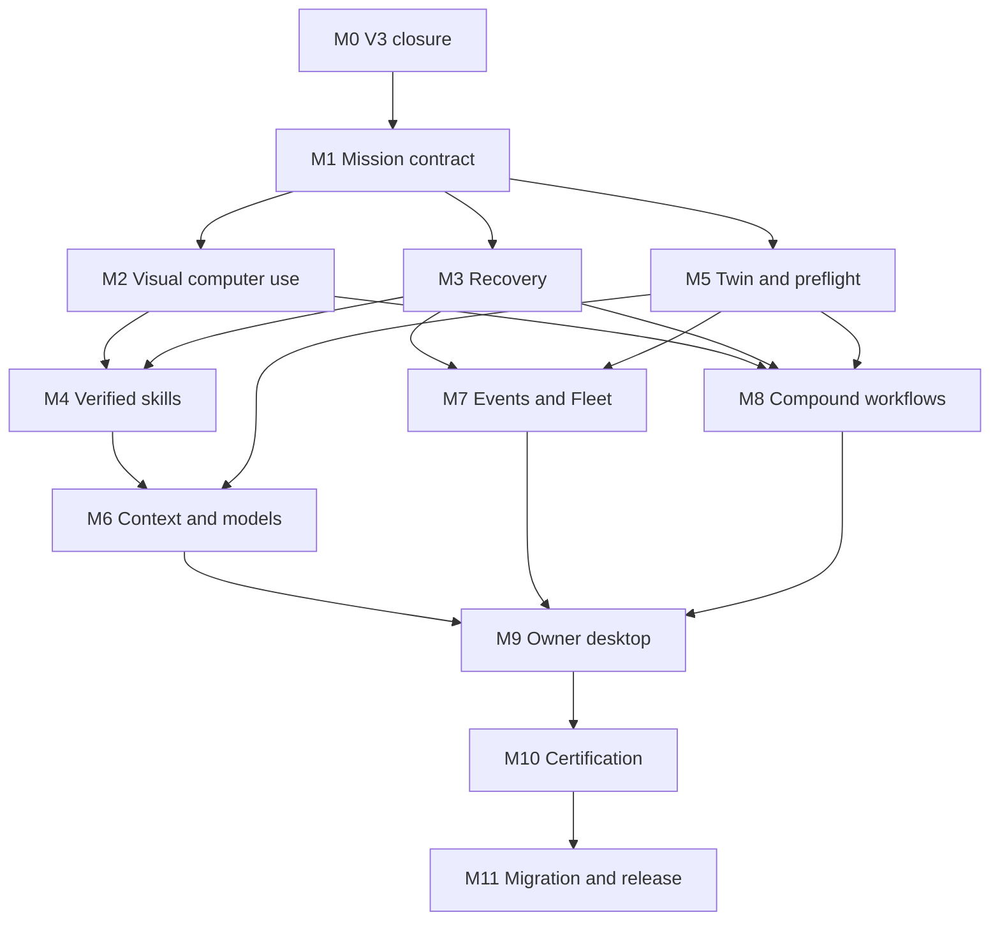

# Epoch 4 — Bossman Continuity

Status: DEFINED; isolated foundation implementation IN PROGRESS; runtime rollout BLOCKED on M0. This is the execution contract,
not a claim of achieved capability. Date: 2026-09-05.

Audited baseline: `d6b43cea0a1127bba7fa2cdabbd80dfa6da681bc` on
`claude/bossman-control-v03-43igbk`. Planning branch:
`astra/epoch4-plan-20260905`. Fable owns current Epoch 3 closure.

## Vision

```text
EPOCH_4_NAME=Bossman Continuity
EPOCH_4_CORE_IDEA=One durable mission contract across applications, agents, models, interruptions and learned workflows.
WHY_THIS_IS_THE_NEXT_GEOMETRIC_STEP=Make existing execution, evidence, recovery, context and placement work together on every mission; a verified improvement then benefits many workflows.
WHAT_V3_ALREADY_SOLVES=Typed execution through existing adapters, signed journals and evidence bindings, guarded compound resume, organization contracts, fleet placement and leases, canonical BCC finalization.
WHAT_V4_MUST_MULTIPLY=The reach and reuse of those guarantees across desktop interaction, mission planning, recovery, skills, routing and the owner interface.
PRIMARY_ARCHITECTURAL_SHIFT=From connected subsystems and separate task loops to a shared mission lifecycle with immutable obligations and explicit adapter boundaries.
OWNER_VISIBLE_PRODUCT_CHANGE=Give a goal once; see the relevant workspace, verified progress and results; continue after interruption without re-explaining or repeating completed effects.
```

Continuity names the missing property of the existing system. It does not imply
AGI, unrestricted self-modification, guaranteed success, or exactly-once delivery
to external systems that cannot support it.

## Three Generations Within Epoch 4

Owner-directed scope amendment, 2026-09-06: deepen the whole epoch by two more
generations and target threefold OS improvement. These are three delivery
generations INSIDE Bossman Continuity, not Epochs 5 and 6. Existing security,
verification, concurrency and M0 closure gates remain mandatory.

### Generation A — Preserve the mission

The initial plan: one immutable mission identity, independent post-state
verification, state-aware computer use, canonical recovery and scoped context.
Deliver M1–M3 and the first integration slices of M5/M9. An interruption changes
the attempt, not the owner's goal, completed effects or authorization boundary.
The unit of work becomes a durable mission instead of an individual model turn.

### Generation B — Adapt the method

Within a validated contract, choose among measured alternative execution
strategies. The system learns which allowed method works in this environment,
while the goal, required evidence and permission floor remain fixed.

- Maintain versioned strategy profiles per task family, application version,
  model and environment class. Record verified outcomes, actual costs, retries,
  latency and uncertainty; do not use model self-confidence as observed success.
- Before execution, compare admissible routes: structured API/DOM/accessibility/
  visual interaction, model choice, context composition and checkpoint cadence.
  Hard policy/privacy/capability/resource filters run before utility ranking.
- During execution, detect drift and lack of progress; reobserve and replan the
  remaining subgraph. A plan change cannot remove an outstanding effect, reuse
  old authorization or clear an unknown irreversible effect.
- Diagnose failures using controlled replays in local fixtures and bounded
  strategy comparisons. Label correlation separately from causality. Promote
  a strategy only against a paired baseline and an independent holdout.
- Reuse the existing router, SelfHealingController, SkillFactory/LearningGuard
  and Fleet scheduler; add measured strategy adapters instead of another set
  of agents, databases or scoring engines. Unknown utility means conservative
  fallback, not permission to explore on risky live tasks.

Generation B acceptance: the same holdout missions complete with fewer avoidable
retries/interventions under injected environment changes, with no quality loss
outside the existing margin and zero policy/evidence violations. At least three
task families and two distinct environment/model configurations must be tested.

### Generation C — Reuse verified capability

Compile recurring verified subgraphs into reusable parameterized execution
recipes. The runtime composes recipes, context and model placement across
missions, while every actual effect still traverses current authorization and
fresh verification. Reuse saves repeated planning, not safety checks.

- Build a dependency index from existing skill versions, capability manifests,
  artifact provenance and contracts. Match typed inputs/outputs, environment
  constraints, permission requirements and evidence requirements before reuse.
- Compile deterministic safe segments to existing executor calls. Keep model
  reasoning at ambiguous boundaries; never replace independent verification
  with a cached success flag. Raw shell learned from arbitrary traces is barred.
- Invalidate recipes when app/schema/model/capability versions, policy, input
  hashes or environment assumptions change. Revocation reaches queued and
  resumed missions before dispatch, not merely the skill picker UI.
- Incrementally refresh context and derived environment views rather than
  replaying full histories/screenshots. Mandatory obligations, prior failures
  and provenance survive compression; protected state is not TTL-evicted.
- Across compatible missions, share only pure computation and permitted model
  residency. Effects, approvals, receipts, tenant-scoped memory and budget
  reservations never deduplicate across mission identities by similarity.
- Schedule ready dependency nodes according to verified model capabilities,
  one unified memory budget, data locality and owner priority. A reused recipe
  may reduce model calls; it never bypasses the canonical ledger/fence.
- Package reusable composite workflows for research/build/test, browser/editor,
  media and project operations through the same contracts. Do not invent a
  special autonomous architecture for each vertical.

Generation C acceptance: novel holdout compositions reuse verified components
across at least three task families without cross-owner data leakage, stale
evidence reuse or privilege expansion. The triple-performance protocol below
must pass before claiming the owner's threefold goal achieved.

### Whole-system depth matrix

| Subsystem | A: preserve | B: adapt | C: reuse and compose |
|---|---|---|---|
| Mission IR | Bound goal/effects/evidence | Revise remaining strategy under same obligations | Typed composition with preserved effect identities |
| Computer / visual | Fresh semantic target and state identity | Select structured or visual route by measured reliability | Environment-scoped reusable interaction recipes |
| Recovery | Signed durable checkpoint / ambiguous-effect block | Failure-conditioned bounded recovery | Reuse proven recovery patterns with current-state revalidation |
| Skills | Trusted trace → experimental version | Holdout evaluation, revocation and applicability | Typed recipe graph and incremental invalidation |
| Environment twin | Bounded operational snapshot | Drift-aware preflight and capacity prediction with uncertainty | Incremental dependency invalidation and permitted locality reuse |
| Simulation | No-effect preflight | Compare alternative plans in controlled fixtures | Validate composed recipes before eligible dispatch |
| Model intelligence | Verified capabilities and privacy filter | Per-family measured utility and calibrated uncertainty | Joint context/model/residency scheduling within one ledger |
| Context / memory | Authority/scope/provenance preserved | Measured retrieval and compression choices | Reusable derived context with dependency tracking |
| Events | Authenticated idempotent intake | Priority/backpressure based on measured capacity | Coalesce equivalent read-only work; retain separate effect contracts |
| Fleet | Leases/fencing and conservative placement | Locality/residency-aware task placement | Compose compatible workloads; never share effect or approval identity |
| Owner control | NEVER/ASK/AUTO with current scope | Preview impact of bounded delegation | Reusable owner-defined permissions; no learned privilege expansion |
| Desktop / apps | Right workspace and truthful timeline | Show alternate methods, blockers and recovery choices | Goal-level workflow reuse with retained advanced inspection |
| Observability | Facts/effects/costs by current run | Compare methods and explain measured tradeoffs | Attribute saved work to actual reused component/version |
| Security | Hard boundaries and adversarial regressions | Attack strategy changes and stale grants | Attack composite recipes, invalidation and cross-mission reuse |
| Certification | Golden mission and crash matrix | Paired strategy A/B and environment drift | Unseen compositions, ablations and triple-performance qualification |

### Threefold performance contract

Freeze the repaired M0 baseline, hardware, task set, permissions, provider/model
versions, budget and workload mix before comparing. Measure the whole system,
including planning, failed attempts, retries, verification, recovery and idle
model residency. Report local/cloud costs separately. No changing to an easier
model/task or spending three times more compute to manufacture a speedup.

| Metric | Definition | Target versus frozen baseline |
|---|---|---|
| Verified throughput | Independently correct completed missions / elapsed active execution hour, fixed workload and resource envelope | >= 3x |
| Cost per verified result | Total measured run cost, including failures/retries/verifiers, / verified completions | <= 1/3 |
| Avoidable owner intervention | Clarification or manual repair caused by missing state/recovery per 100 attempted missions | <= 1/3 |

For local-only runs where monetary cost is unmeasured, report cost as a vector
of input/output tokens, CPU/GPU time and peak/resident memory; require at least
threefold reduction in the preregistered dominant resource without regression
in the other measured resource caps. Do not call free/unknown API pricing zero
total system cost. Mandatory owner approvals do not count as avoidable
interventions and must never be removed to improve this metric.

Reliability, correctness, privacy and security are constraints, not tradable
score multipliers. All required effects remain verified; the existing verified
success noninferiority margin is at most 1 percentage point; zero accepted
security bypasses and zero duplicate irreversible effects remain absolute gates.
If the baseline already has zero interventions/errors, the ratio is N/A and
the zero must be preserved; never divide by zero or claim an infinite gain.

Qualification protocol:

1. Predeclare task families, task weights, difficulty, supported platforms,
   budgets and expected artifacts. Use G01–G24 plus novel composed holdouts;
   training/replay traces cannot appear in the holdout set.
2. Run A versus M0, B versus A, C versus B, and final C versus M0. At least
   100 paired runs per declared aggregate; report each task family separately.
   Pair input/seed/environment where possible and alternate execution order.
3. Report all attempts, sample counts, warm/cold residency, costs, p50/p95,
   verified success and reasons for interventions. Include failed and aborted
   missions in cost/time denominators; never silently discard difficult runs.
4. Bootstrap paired task-family samples for 95% confidence intervals. Claim
   the throughput target only if the lower bound is >= 3; cost/intervention
   reduction only if the upper bound is <= 1/3. Small/zero baselines are
   INSUFFICIENT_EVIDENCE rather than a successful ratio.
5. Ablate recipe reuse, strategy selection, incremental context and residency
   one at a time. Explain which component produces which measured gain;
   geometric benefit is not the product of correlated synthetic scores.
6. Re-run security/crash/privacy suites for the winning configuration. If the
   target fails, publish the actual ratios and bottleneck, retain the best
   safe configuration, and do not announce '3x achieved'.

### Delivery order for the deeper generations

The existing M0–M11 integration graph remains authoritative. M4–M7 now deliver
Generation B adapters after A's contracts/observations/recovery are accepted.
M8 composes Generation C recipes on the existing factories; M9 presents all
three levels without exposing implementation internals. M10 adds the paired
and novel-composition qualification; M11 releases the measured configuration.
Each milestone may have A/B/C evidence slices; closing an A slice does not
close the whole milestone. Runtime activation still waits for M0 and the
relevant dependency gates. Do not start a parallel kernel or widen trust.

Record `GENERATION_A/B/C=NOT_STARTED|PARTIAL|ACCEPTED` and
`TRIPLE_PERFORMANCE=NOT_MEASURED|INSUFFICIENT_EVIDENCE|NOT_MET|MET` in the release
report. Current status: A=PARTIAL (isolated foundations), B=NOT_STARTED,
C=NOT_STARTED, TRIPLE_PERFORMANCE=NOT_MEASURED. No generational acceptance is
claimed by this plan amendment.

### Open-source reuse

The owner explicitly permits compatible open-source implementations. Prefer
existing repository modules, then mature dependencies or narrowly adapted
upstream code when they remove a demonstrated gap. Record source URL, license,
copyright/attribution, exact commit/version, modified files, purpose, runtime
and memory cost, transitive dependencies, vulnerability scan and rollback.
Check actual license terms before incorporation; do not infer permission from
public visibility. Preserve required notices and avoid incompatible licensing.

Untrusted upstream code never runs an install hook or gains filesystem/network
permissions merely because it is open source. Review its execution boundary,
pin versions, test the real integration and adversarial inputs. No new resident
model for each logical role, duplicate orchestrator, hidden telemetry, silent
cloud upload, or weakened policy/verification in exchange for apparent speed.
External selection follows a concrete implementation need, not an unbounded
list of fashionable frameworks. No new upstream dependency is selected by
this amendment itself.

## Why This Epoch Exists

### Repository evidence, not module counting

The following was inspected at the baseline above. Historical reports provide
context, not current certification. Imported ZIPs and unmerged branches are not
capabilities of this baseline.

| Area | Existing implementation and integration | Gap this epoch must close |
|---|---|---|
| Computer execution | `bossman-core/bossman_v3/computer_agent/agent.py`; `adapters/command_center.py`; organization bridge uses `CompoundRunner` | Typed action path exists. Add semantic pre-observation, state identity and multi-app transitions through these adapters, not another executor. |
| Visual state | `bossman-core/bossman_v3/visual_state/fusion.py` and `models.py` | No production call site found outside the module in the inspected Core/BCC/V3 source. Fusion checks the freshest fragment, so mixed-age fragments and cross-window identity need explicit rejection tests before integration. |
| Durable truth | `bossman-core/bossman_v3/memory/journal.py`, `execution/compound.py`, `bossman_shared/action_receipt.py`, `evidence.py` | Preserve signed completion, plan binding, durable effect intent, writer lock and unknown-effect blocking across all new mission entry points. |
| Recovery | `recovery_kernel/kernel.py`; `self_healing/controller.py`; BCC recovery features | `FileCheckpointStore` explicitly says demo/test. A mutable `verified` flag plus a hash is not a trusted production checkpoint. Adapt the canonical journal and receipt store. |
| Skills | V3 `skill_factory/factory.py`, Core `apprentice` / `learning_guard`, BCC skill library/evaluation | Candidate/promotion logic already exists, but V3 factory has no production caller in the searched source. Connect verified traces, environment applicability, versioning, revocation and measured replay without trusting caller-supplied success booleans. |
| Mission contracts | `organization/contracts.py`, planner and bridges; BCC `finalize.py` and action contracts | Compile owner intent to obligations before dispatch, carry the same digest into every adapter, and reconcile distinct completion semantics. |
| Reality branch | `docs/v3/CODEX_REALITY_MERGE_ANALYSIS.md` documents a trial merge of `codex/reality-compiler-v010` at `be66974` | Merge was cancelled after three completion/resume tests failed. Reaudit its latest SHA; preserve strict finalization and prove receipt delivery before selective integration. |
| Environment / Fleet | `fleet/twin.py`, scheduler, leases, queue, resource reservations | Twin and placement already exist. Add bounded operational probes and model residency integration; production remote transport remains unavailable. |
| Events | `organization/events.py` already provides reaction templates, dedup and backpressure | README says Autonomous Operations not started; the primitive exists. Connect authenticated intake and crash-safe mission creation; events never authorize tool execution. |
| Context / models | V3 assembler/guardian, organization memory scope, Core context engine/Gateway, BCC model intelligence/router | Preserve ownership and authority across hierarchical scopes; measure provider-specific serialized context, verified capability routing, privacy and residency together. |
| Owner interface | BCC `features/control_plane.py`, `ui/pages/control.js`, `capability.py`, mission console | Build on current-run evidence and blocked reasons. Add one mission timeline and automatic workspace selection without replacing the panel wholesale. |
| Media / web | `docs/v3/AUDIT_VIDEO_STUDIO.md`, `AUDIT_WEB_DESIGNER.md` describe separate branches | Branch findings are integration prerequisites, not proof the default tree contains those implementations. Do not merge known destructive editing/export paths. |

### Exact baseline release evidence

GitHub Actions API was queried by the full baseline SHA; push runs were included.

| Workflow | Result | Run |
|---|---|---|
| root-ci | PASS | [33991193100](https://github.com/molotroka123-cell/AiMaxBossman/actions/runs/33991193100) |
| Bossman Core CI | FAIL | [33991192864](https://github.com/molotroka123-cell/AiMaxBossman/actions/runs/33991192864) |
| Command Center CI | FAIL | [33991192813](https://github.com/molotroka123-cell/AiMaxBossman/actions/runs/33991192813) |
| ASTRA acceptance | FAIL | [33991193093](https://github.com/molotroka123-cell/AiMaxBossman/actions/runs/33991193093) |
| Solana safety | PASS | [33991192844](https://github.com/molotroka123-cell/AiMaxBossman/actions/runs/33991192844) |
| Bossman V2 Auto-Repair | PASS | [33991192881](https://github.com/molotroka123-cell/AiMaxBossman/actions/runs/33991192881) |

Failures read from job logs:

- Windows ASTRA job `101373614220`: 1 failed / 96 passed. Evidence key changes
  after cache reset because `os.open` creates a text-mode descriptor on Windows;
  an LF byte becomes CRLF. `bossman_shared/evidence.py` lacks `O_BINARY` on the
  key creation descriptor. Fix must cover predetermined binary bytes and reopen,
  preserve existing keys, and separately address malformed legacy files.
- Core coverage job `101373613921`: 6 failed / 2029 passed / 47 skipped /
  2 xfailed. Coverage was 86%, above its 85% gate. One failure is missing pinned
  historical commit `8a13f1d35cd68a57f1525bcc6a1a1c1b6c6d191a`; five concern
  real sandbox execution. The coverage job lacks the full-history checkout and
  explicit sandbox environment used by the matrix jobs. Do not lower coverage
  or relabel hardware skips as a successful sandbox test.
- CC Python 3.11 job `101373651656`: 31 failed / 1493 passed / 5 skipped.
  Many expect `completed` where strict finalization returns `waiting_approval`;
  one owner-action test omits a runnable agent and now gets `blocked`; a long
  mission times out. Each must be classified as missing post-state contract,
  broken adapter, or obsolete test expectation. Never fix the suite by
  accepting tool text as evidence. Python 3.12 also failed; its individual
  failure set is not assumed identical without reading its log.

These are observed baseline failures, not a complete P0/P1 inventory. Fable may
already be fixing them. Re-fetch and compare before any repair. Local runtime
tests have not been run for this planning commit; default Python lacks pytest.

## Geometric Progression From Previous Epochs

There is no claim that the historical releases had these formal epoch names.
These are conservative architectural summaries; V1/V2 docs overlap in time and
the packages coexist. They are not invented release dates or certifications.

| Epoch | Architectural stage | Repository basis |
|---|---|---|
| 1 | Local agents and policy-controlled tools | Core Gateway, tools, approvals and desktop operator; `docs/context/V1_RC_FINAL_REPORT.md` includes live/host limitations. |
| 2 | Mission orchestration and operator control | `docs/V2_IMPLEMENTATION_REPORT.md`: feature hooks, persistent missions, worker pool, router, governor, browser, terminal, skills and MCP. |
| 3 | Evidence-bound execution and recoverable coordination | V3 journal/compound/adapters, Organization and Fleet; commits `2c6c1ef`, `558a764`, `000f331`, `db5defb`, `2077bbf`. Current closure is still in progress. |
| 4 | Bossman Continuity | This defined execution contract; delivery requires the gates below. |

The multiplier is reuse of one mission's identity and verified state: better
observations improve recovery; recovery preserves learning traces; verified
skills reduce repeated model work; routing and context reuse improve each
subtask. Report measured outcomes, never products of arbitrary numeric scores.

## Architecture

### Canonical path and ownership

Owner goal → validated Mission IR → capability/dependency resolution → preflight
→ existing Organization/Compound/BCC execution → fresh observations → canonical
verification/finalization → durable checkpoint → recovery or verified skill
candidate → scoped context for the next mission.

1. `bossman_shared` owns serializable cross-package contracts. Introduce a
   versioned Mission IR schema here, not a second policy engine or database.
2. `bossman_v3` remains the home for existing coordination components. Epoch
   naming does not require renaming its package or breaking imports.
3. BCC remains the owner-facing execution/control plane; Core Gateway remains
   the model boundary. Each integration uses adapters over existing ports.
4. TaskJournal and canonical BCC tables retain their existing responsibilities.
   Mission IR records their identifiers and obligations; no competing task
   completion store is introduced. A mismatch blocks with an explicit reason.
5. `bcc.finalize.finalize_task` remains the BCC finalization authority. Core
   action completion must likewise require independent effect verification;
   informational answers remain distinguishable from completed actions.
6. Recovery reads verified journal state; uncertainty about an irreversible
   effect means reconcile or wait. Never downgrade this to an ordinary retry.
7. Derived timelines, twins, skill statistics and context caches are rebuildable
   views. They cannot change permissions, receipts or completion truth.

### Mission IR contract

Required fields: schema version; owner/project/mission identity; immutable
revision and digest; goal; expected state changes; required effects with stable
effect IDs; independent verifier kind/target/expectation/freshness; capability
requirements; dependency DAG; privacy class; risk; authorized scope references;
budget and reservation references; recovery/retry bounds; success conditions;
artifact references; provenance. Attempt, run, worker and fence are execution
bindings, not permission to change the goal contract.

Reject unknown effect/verifier kinds, empty obligations for effectful missions,
cycles, missing dependencies, nonfinite/negative budgets and unsupported schema
versions. Model output is a candidate IR only. Server validation and existing
owner policy determine whether it may execute. A hash proves identity, not
authorization. Evidence also binds current mission/effect/expectation/attempt.

Intent amendments create explicit revisions, preserve prior effects, and
invalidate affected grants/evidence. The model cannot revise success criteria
after execution to fit the result. Read-only simulation uses the same validator
and capability/policy APIs; it creates no approvals and performs no effects.

### Visual observation contract

Every actionable observation carries application/window identity, document or
navigation generation, source, observed time, state revision, modality and
confidence. Bind element references and coordinates to that state. Reobserve
after navigation, modal change, focus/window change or stale observation.
Conflicting structured sources block action selection; vision is a hint, never
authority. Reject future timestamps and stale individual fragments. Snapshot
references are bounded and privacy-scoped, not a permanent screen recording.

### Permissions and self-improvement

Map owner-facing NEVER / ASK / AUTO to existing deny/ask/allow semantics.
DENY remains dominant across every adapter; pending or stale approval cannot
become AUTO on retry, model fallback or skill replay. Scope includes operation,
resource, owner/project/mission, expiry and current implementation identity.
Payments always require explicit approval; existing deny-only surfaces remain
denied until deliberately reviewed. This plan authorizes no messages, payments,
live trades, blanket installations or public deployment by the product.

Skill/routing/context candidates may improve under measured evaluation. Trust
kernel, approval, evidence, Treasury and recovery-invariant changes require an
independent specialist review plus adversarial regression before promotion.
Neither a model nor a learned skill can approve its own privilege expansion.

## Milestones

All rows start NOT STARTED except M0, owned by Fable and IN PROGRESS. A milestone
closes only with code, integration, test/red-team evidence and a remote SHA.

| ID | Deliverable / problem and shared value | Dependencies / integration | Acceptance and risk gate | Rollback |
|---|---|---|---|---|
| M0 | Close reproducible V3 blockers; establish reliable baseline for every workflow | Fable current branch; six release workflows and current audit ledger | Repository-local P0/P1 zero after retest; all six workflows green on one SHA; Windows key stability; CC effect contracts; legitimate host exclusions recorded | Revert defective repair by new commit; preserve journals/keys; never weaken gates |
| M1 | Versioned Mission IR, capability graph and admission contract; eliminate incompatible success semantics | M0 for runtime enablement; shared schema, CapabilitySpec, delegation contract, strict finalizer; selectively reconcile Reality branch | Golden G01/G02/G12/G14/G19; parser, digest and migration attacks; real effect reaches final verifier through API | Flag off; legacy unbound tasks stay legacy; participating tasks parked safely |
| M2 | Production visual state and Windows desktop bridge; consistent state across applications | M1, existing UCA/Apprentice/BCC ports | G03/G04/G05; stale/mixed/window-confused targets rejected; observed file/window post-state on Windows | Disable adapter and release input ownership; do not replay queued coordinates |
| M3 | Unified recovery and durable mission continuation | M1; TaskJournal, existing BCC recovery and fencing | G06/G07/G08/G23; crash matrix passes; unknown effects never repeated; confirmed effect survives restart | Stop dispatch; read-only reconcile; retain in-flight effect intents and reservations |
| M4 | Verified skill lifecycle shared by learning paths | M2 + M3; SkillFactory, Apprentice/Learning Guard, BCC skill versions/evaluation | G09/G10; independent trace provenance, holdout replay, revocation, rollback and zero privilege growth | Revoke candidate version; restore prior pinned version; never delete evidence |
| M5 | Operational twin, preflight and model residency | M1; FleetTwin/registry, capability probes, resource reservations and Gateway | G11/G12/G13/G24; memory pressure cannot load beyond one unified pool; simulation has zero effects | Disable new placement strategy; use conservative existing scheduler, retain unknown reservations |
| M6 | Context hierarchy and evidence-driven model choice | M1 + M4 + M5; scoped memory/assembler, BCC router and Core Gateway | G13/G14/G15; no private cloud egress including fallback; scope isolation; measured token/cost limits | Prior router/context strategy; preserve scopes and privacy floor; invalidate derived caches only |
| M7 | Authenticated event-to-mission execution and Fleet integration | M3 + M5; existing EventIntake, Organization store, queue/leases | G16/G17; concurrent dedup, intake crash/outbox recovery, restart backpressure, lease loss and fencing | Pause event intake; drain queue safely; preserve event keys and effect intents |
| M8 | Research→Build→Test→Fix→Verify compound workflow; media/web capabilities | M2 + M3 + M5; existing Dev/Video factories and reviewed app branches | G18/G19/G20/G21; preserve files and structured failure reasons; render independently checked; no deploy without policy | Per-app feature off; restore versioned project artifacts after explicit conflict check |
| M9 | Mission-first owner desktop and workspace invocation | M1 + M3; progressive integration of M2–M8; existing control view, mission console and app registry | G04/G18/G20/G21/G22; every visible action has handler, state/evidence view or precise block; keyboard and live browser QA | Restore prior navigation; canonical lifecycle remains readable; no status rewriting |
| M10 | Full golden, chaos, security and performance certification | M1–M9 integrated | All required G01–G24 and gates below on release candidate SHA; independent red-team review; no unclassified failures | Hold release; revert isolated bad milestone; keep durable data and compatibility reader |
| M11 | Migration rehearsal, opt-in canary, release evidence and rollout | M10 | Two clean-install/upgrade/rollback rehearsals; canary metrics pass; exact-SHA release CI; explicit capabilities/platform manifest | Disable rollout; drain/park; revert code with compatible reader, not destructive schema rollback |

The plan commit must be pushed before specialist implementation starts. While
Fable closes M0, specialists may implement isolated schemas, fixtures and
disabled adapters in non-overlapping files. No broad live execution or rollout
on the failing base. M0 fixes remain with Fable unless ownership is explicitly
reassigned after checking the latest commits.

## Agent Workstreams

Launch specialists only after this plan exists remotely. Each owns isolated
files/worktree, implements, tests, red-teams, and reports evidence. All start by
reading the plan and applicable repository instructions. No concurrent edits
to a shared worktree. The lead is the final integrator, not an additional writer
in another agent's files.

| Stream | Ownership | First bounded batch after plan push | Independent reviewer |
|---|---|---|---|
| A — Computer / visual / OS | M2, new visual contracts and adapters | Fix mixed-age/window ambiguity with executable regression and disabled adapter wiring | B for effect boundary; E for real GUI |
| B — Mission / recovery / truth | M1, M3; schema and recovery adapter | Immutable IR and contract-to-required-effects bridge tests; do not overwrite Fable's finalizer/evidence fixes | E plus lead for trust-kernel changes |
| C — Skills / context / model intelligence | M4, M6 | Trace-to-candidate provenance and revocation adapter over existing skill versions | B for authority; D for privacy/resources |
| D — Twin / resources / events / Fleet | M5, M7 | Read-only preflight from current registry/twin; shared-memory admission and zero-effect simulation tests | B for leases/retry; C for routing |
| E — Owner UX / app integration / golden / red-team | M8–M10 with lead integration | Build first API-to-filesystem golden fixture and evidence report schema; then mission timeline projection | A for UI state; B for truth |
| Lead — Integration / release | M0 coordination, shared-file changes, M11 | Reconcile upstream; pin interfaces; run affected suites; push verified batches | Independent stream reviewer for any security-sensitive patch |

Every batch report includes: baseline SHA; files; problem; why current code does
not solve it; shared value; dependencies; changed behavior; tests/commands and
counts; real vs simulated boundaries; red-team cases; risks; rollback; commit
SHA; known failures. Test doubles for model/network boundaries are labelled.
No invented agent names or coauthor identities in Git history.

## Dependency Graph



Contracts and disabled fixtures may proceed independently of M0; graph edges
are integration/acceptance gates. Stream E develops certification throughout,
not only after all implementation finishes.

## Acceptance Tests

Evidence tiers: UNIT (pure logic), INTEGRATION (real local stores/processes),
LIVE_LOCAL (actual application/model), LIVE_EXTERNAL (authorized remote
service), HARDWARE (declared machine). A tier cannot substitute for another.
Every result records SHA, dirty-tree flag, OS/runtime, feature flags, model/tool
versions, fixture seed, start/end, assertions, artifact references and SHA256,
counts, skips with reasons, expected effects, observed effects, retry count and
cost. A dirty tree is developmental evidence, never release certification.

Use current tests for journal/compound/evidence, organization/Fleet, canonical
finalization, tool/approval identity, privacy, memory scope and resources.
Add integration tests at adapter boundaries, not tests that merely mirror a
dataclass. Root `tests/`, Core `bossman-core/tests/`, CC `command-center/tests/`
remain canonical; run components separately to respect conftest ownership.
Install the shared distribution alongside the components, as current CI does.

Before each integration: fetch, review diff, run changed-component tests and
cross-boundary regressions. Before release: full root/Core/CC suites, all six
required workflows, golden/crash/soak suite on one immutable candidate. Do not
change HEAD while SHA-bound benchmark tests execute. Do not delete their
worktrees. Historical benchmark fixtures require their real commit objects.

## Golden Missions

Run through the real mission intake, adapter, store and finalization path.
The model may be deterministic in CI; the filesystem/DB/process effect and
post-state verifier must be real. External sites use owned test services; no
actual outreach, payments or trading in certification.

| ID | Mission | Independent oracle / acceptance |
|---|---|---|
| G01 | Goal → file create/edit | Independently reopen exact expected path and bytes; IR bound before dispatch |
| G02 | Model claims success without effect | Required file absent; mission never COMPLETED |
| G03 | Browser form on local test server | Query persisted server row; fresh page state; exactly one submission |
| G04 | Browser → editor → file | Read file and observe correct active app; preserve one mission identity |
| G05 | Stale target / modal / changed window | No wrong click or mutation; fresh semantic resolution or explicit block |
| G06 | Process restart after verified step | Real subprocess killed/restarted; completed effect count unchanged |
| G07 | Crash after irreversible effect before journal receipt | External fixture ledger shows one effect; resume parks UNKNOWN, never resends |
| G08 | Browser/app crash before effect | Reobserve, bounded recovery and independent final-state check |
| G09 | Repeated verified workflow → skill → reuse | Candidate from trusted trace; holdout execution creates independently verified result |
| G10 | Skill revocation / environment drift | Revoked/inapplicable version cannot dispatch; prior safe version or block |
| G11 | Missing app/model and full disk | Accurate preflight blocker, zero mutations, no invented installation |
| G12 | Simulation of risky plan | Real call/DB/filesystem spies show zero effects and no created approval |
| G13 | PRIVATE/LOCAL_ONLY with model outage | Observe outbound transport: zero cloud payloads on all fallback paths |
| G14 | Cross-project memory injection | Other-owner facts excluded; malicious memory cannot add grants or alter obligations |
| G15 | Long context and model switch | Final serialized request stays within configured tokenizer budget; required constraints retained |
| G16 | Duplicate event and intake crash | Concurrent deliveries and process restart produce one mission, not lost accepted events |
| G17 | Lease expiry / worker replacement | Stale worker cannot perform or finalize effect; current fence owns result |
| G18 | Research → code repair → test → artifact | Local source attribution retained; failing fixture repaired; independent subprocess test pass |
| G19 | Deployment preparation with denied deploy | Build artifact verified; deploy count zero; precise approval/policy state |
| G20 | Video edit/export | Real FFmpeg/ffprobe; playable artifact, expected duration/audio/tracks; output-path and resource guards |
| G21 | Web Designer edit/undo/export | SVG/MathML and unrelated nodes preserved; stale revision rejected; independent parse/browser render |
| G22 | Owner reject/cancel/takeover/resume | Backend state and UI agree; no post-rejection or post-cancel dispatch; resume revalidates grants |
| G23 | 50/100/200-step mission with failures | Independent per-effect ledger; checkpoint continuity; bounded retry/context/resource growth |
| G24 | Local LLM + image + video + structured model placement | Synthetic 128 GB pool rejects overcommit; actual AI Max run separately measures residency/unload behavior |

Additional platform scenario for M2/M11: install an approved benign fixture app,
verify its executable/version/window, restart, uninstall in the controlled lab.
Unsupported desktop/platform actions must report unavailable, never simulated
success. Windows is required for desktop certification; Linux portable tests
are required, full Linux desktop support is deferred.

## Security Gates

Zero accepted bypasses across: prompt/memory injection, tool confusion,
cross-task/current-attempt evidence, stale/replayed approvals, policy changes
between approval and dispatch, signature tampering, context-scope forgery,
path traversal/symlink swaps, command/FFmpeg injection, origin/navigation
confusion, SSRF/DNS races, archive bombs, unknown-price budget bypass, malicious
MCP/plugin output, resource overcommit and zombie-worker finalization.

Crash matrix: before dispatch; after durable intent; after dispatch before
effect; after effect before receipt/journal; after approval consumption; during
verification; after verified checkpoint before completion publication. Run
each against read-only, idempotent-write and irreversible-effect fixtures, with
at least 10 deterministic seeds per applicable cell. Acceptance: zero duplicate
irreversible effects, zero false completion, no dropped obligation, no automatic
release of unknown external costs. External idempotency keys or reconciliation
are required where exactly-once cannot be proven; ambiguity must remain visible.

Run secret scan after staging (it checks tracked content); retain current
Bandit/SCA gates and fail on tool errors. Windows key confidentiality needs an
ACL test, not POSIX mode bits. Missing hardware is a release qualification gap,
not a reason to weaken the trust boundary.

## Performance Gates

Measure on fixed fixtures and record the actual host. These are acceptance
targets, not measured baseline claims. Warm up once, run five measured repeats,
report median and p95 with sample counts. Separate model and application
latency from mission-layer overhead.

- Local preflight/contract validation p95 <= 250 ms for 100 actions/500
  capability records; no network probe hidden in that synchronous path.
- Same-host deterministic golden suite p95 total time regression <= 10%
  against the frozen M0 baseline; security-required overhead is recorded and
  explicitly reviewed, never silently exempted.
- 200-action soak after warmup: orchestration RSS growth <= max(50 MiB, 15%
  of warm baseline); after drain, threads/child processes/open DB connections
  return to baseline + at most 2. Browser/model workers are measured separately.
- At most 3 automatic recovery attempts per step and 10 per mission by default;
  stricter owner budget wins. No endless retry, polling or event amplification.
- Final request fits configured provider tokenizer budget, including system,
  tools, serialized arguments and reserved output. If exact tokenizer is
  unavailable, report ESTIMATED and reserve an explicit margin; do not certify
  exact-fit behavior from the current character estimator.
- Repeated-workflow holdout: >= 20% median input-token reduction after skill/
  context reuse, verified-success drop <= 1 percentage point over at least
  100 paired runs; zero security failures. No mandatory speedup claim for every
  workflow or unreliable model.
- Shared CPU/GPU memory is one pool on AI Max; weights, KV/cache, image/video
  workspace and OS reserve are accounted once. Unknown footprints cause defer
  or conservative admission. Synthetic topology is not hardware attestation.
- API/control view uses measured route latency and explicit unavailable SLOs;
  snapshot/timeline refresh must not restore duplicate-fetch/per-request-write
  regressions fixed in `d5d38aa`.

## Migration

1. Freeze M0 SHA and record schemas, flags, registered capabilities, active
   missions, uncertain effects and budget reservations. Back up durable stores
   and keys using the existing access policy; never put secrets in Git.
2. Add versioned IR and additive nullable references. Readers distinguish
   legacy tasks from IR-bound tasks. Do not infer verified state from old text
   or manufacture signatures for legacy records.
3. Shadow compile new goals with execution disabled; compare against actual
   existing contract/effect paths. Capture disagreements as blocked cases.
4. Enable an opt-in mission cohort only after M0 and relevant milestone gates.
   Once a mission is IR-bound, flag changes cannot move it onto the legacy
   path. Resume uses its pinned version and current authorization.
5. Project old/new lifecycle views from existing stores. Use one authoritative
   writer per effect/receipt/approval. If a transaction spans stores, use a
   durable outbox and reconciliation, not best-effort dual writes.
6. Rehearse SQLite and PostgreSQL upgrade/restart on populated fixtures with
   pending approvals, revoked skills, in-flight effects and unknown cost.
7. Canary all eligible deterministic golden missions, then required Windows
   desktop and local-model scenarios. Expand only with recorded evidence.
8. Remove no legacy reader or schema during this epoch's initial release.

### Rollback strategy

Disable new intake/dispatch, drain safe work and park ambiguous effects. Switch
off feature-specific adapters, retain compatibility readers and restore the
previous code release. Never drop new ledger rows, roll back evidence keys,
erase event dedup, restore an old DB over post-backup effects, or replay a
mission to make a dashboard green. Artifact undo checks current revision before
restoring. Test rollback before first canary, including restart while rollback
is pending. An irreversible effect may require reconciliation, not reversal.

## Release Criteria

`V4_COMPLETE` requires all of the following at one frozen release SHA:

1. M0–M11 closed with linked evidence; repository-local P0/P1 = 0 after fresh
   independent review. Baseline failures or unresolved branch findings in
   shipped code cannot be waived by a documentation status.
2. All six named workflows green on that SHA, including Windows portable.
   Skipped optional sandbox job is not sandbox acceptance; required hardware
   and live scenarios have separate successful attestations.
3. G01–G24 meet their required tiers. Ten consecutive deterministic suite runs
   have zero unexplained failure, false completion or unsafe effect. Desktop
   missions pass on Windows with at least browser, editor and media workspace.
4. The full crash matrix and 50/100/200-step soak pass; deployment remains
   policy-controlled and all denied-action scenarios produce zero effects.
5. Skills are versioned/revocable, replay on fresh observations, and produce
   measured reuse benefits. Trust/security-kernel self-modification is gated.
6. PRIVATE/LOCAL_ONLY holds during routing/worker failure. Resource and money
   accounting share canonical ledgers and survive restarts.
7. Migration and rollback rehearsals pass on populated data; owner UI exposes
   actual evidence, unknown states and usable recovery controls.
8. Release manifest lists supported capabilities/platforms and external/hardware
   limitations. Required branch protection is verified by an authorized repo
   administrator; unavailable admin access is an OWNER_ONLY blocker.
9. All three internal generations are accepted with their dependency and
   holdout evidence. Report the threefold-performance verdict separately;
   the owner's 3x objective is unmet unless every applicable primary metric
   meets the confidence-bound gate. Technical completion must not be presented
   as achievement of the unmeasured or unmet performance objective.

`V4_FUNCTIONAL_BETA`: integrated mission loop demonstrated, but some required
certification/platform gates remain open; opt-in only, documented scope.
`V4_FOUNDATION_COMPLETE`: M1 contracts and core integration foundation accepted,
but the complete user loop has not been certified. A plan alone is insufficient.
`V4_NOT_COMPLETE`: plan only, blocked baseline, or unaccepted integration.
Use exactly one verdict and explain the missing gates. No maturity score is
raised merely because files, agents or modules exist.

## Execution Discipline and Concurrent Work

- Before each meaningful batch and push: `git fetch --all --prune`, inspect
  current primary HEAD and new commits. Record upstream changes ingested.
- Fable owns M0 and its currently edited files. Specialist agents work on
  isolated branches/worktrees; shared contracts are pinned before consumers.
  Lead owns README, canonical plan and shared integration files.
- Push this plan before implementation; push each tested coherent milestone.
  Preserve Fable's remote commits, even if the local tree is ahead/diverged.
- Fast-forward only; no force push, remote reset or silent revert. Rebase or
  selectively integrate semantically; rerun affected tests after conflicts.
- Do not push repeatedly during final CI certification; freeze a candidate.
  Cancelled and running jobs are not PASS. Recheck remote SHA before reporting.
- If write credentials are unavailable, preserve the concrete plan/patch and
  report the specific external blocker. Do not claim a push or bypass access
  controls. Specialist implementation waits for the required plan push.

### Evidence-driven plan amendments

Record date, old/new milestone or contract, WHAT CHANGED, WHY, EVIDENCE (SHA,
test/log), IMPACT (dependencies, compatibility, risk, gates), and reviewer.
Routine implementation choices do not reopen the epoch design. Changing
release thresholds or widening trust requires an explicit amendment and review.
Initial revision: architecture and roadmap defined from the baseline above;
no implementation deviations yet.

Owner scope amendment, 2026-09-06:
WHAT CHANGED: added two internal generations (adaptive method selection and
verified recipe composition), whole-system depth matrix, triple-performance
qualification and explicit open-source reuse policy.
WHY: direct owner request to deepen V4 by two generations and triple OS metrics.
EVIDENCE: current isolated visual/IR/preflight/skill foundations and golden
tests expose the composition boundaries; they provide no measured 3x result.
IMPACT: M4–M10 acceptance expands; current trust/M0/rollback gates remain;
Epoch 5 remains unknown. Expanded implementation starts only after this
amendment is committed and published, and its dependencies are accepted.

## Deferred Items

Production remote Fleet transport and node authentication are a separate gated
extension, not required to claim existing local coordination works. Full Linux
desktop parity, mobile-native redesign, replacing PostgreSQL/BCC storage,
arbitrary plugin marketplaces and training model weights are deferred. Remote
Fleet stays honestly unavailable until authentication, fencing at the effect
boundary, partition recovery and privacy have independent live certification.

## Explicit Non-Goals

No parallel policy/budget/receipt databases. No replacement of working Fable
fixes. No blanket module rewrite or package rename to make version numbers
match. No unreviewed media/web branch merge. No live Solana/trading expansion,
autonomous payments, mass outreach or public deployment as test shortcuts.
No continuous screen surveillance, raw chain-of-thought export, automatic
promotion of every trace, or unconstrained security-kernel self-modification.
No claim that 128 GB hardware tests ran on a machine not actually available.

## Epoch 5

???
